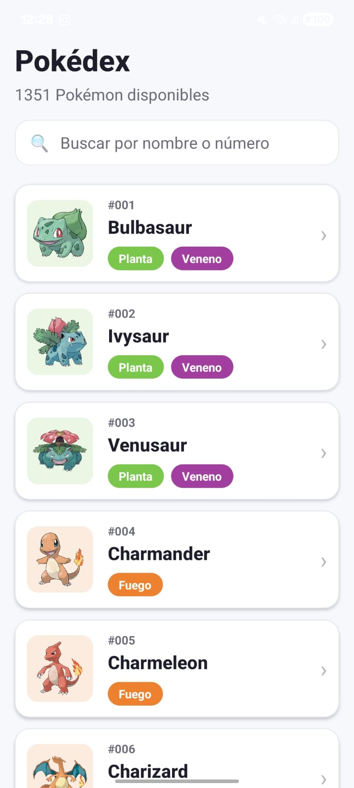
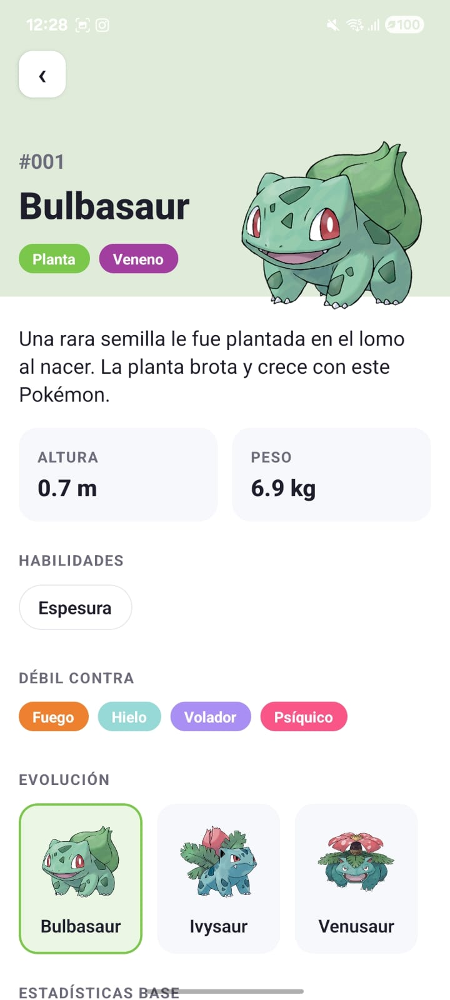
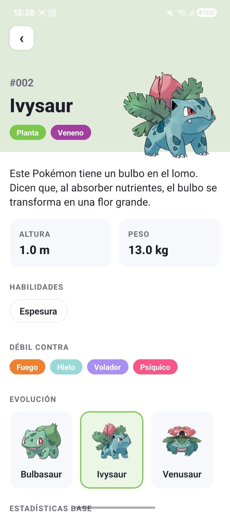
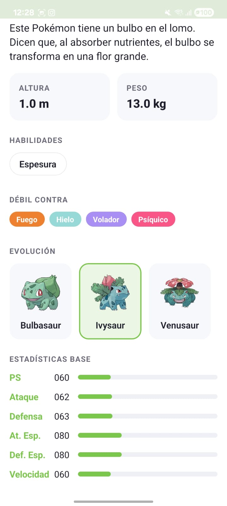

# Pokédex — React Native Challenge

Aplicación móvil (Android/iOS) que lista los primeros 20 Pokémon desde [PokéAPI](https://pokeapi.co/), con paginación incremental, buscador, pantalla de detalle (descripción en español, debilidades y cadena evolutiva navegable) y soporte offline parcial. Construida con **React Native + Expo (bare workflow)**, **TypeScript estricto** y **Clean Architecture de 4 capas**.

## Cómo ejecutar

```bash
# 1. Instalar dependencias
npm install

# 2. Ejecutar en iOS (requiere Xcode)
npm run ios

# 3. Ejecutar en Android (requiere Android Studio / emulador)
npm run android

# Alternativa: iniciar el dev server para un dev client ya instalado
npm start
```

### Correr los tests

```bash
npm test          # tests unitarios (Jest + jest-expo)
npm run typecheck # verificación de tipos (tsc --noEmit)
```

## Arquitectura

Clean Architecture de 4 capas. La regla de dependencia apunta siempre hacia el dominio: `presentation → application → domain ← infrastructure`.

```
src/
├── domain/            # Núcleo: sin dependencias externas
│   ├── entities/      #   PokemonSummary, PokemonDetail, PokemonPage
│   ├── enums/         #   PokemonTypeName, PokemonStatName
│   ├── errors/        #   DomainError (Network | NotFound | Server | Unknown)
│   └── repositories/  #   PokemonRepository (interface / puerto)
│
├── application/       # Casos de uso: orquestan el dominio
│   └── use-cases/     #   GetPokemonPageUseCase, GetPokemonDetailUseCase
│
├── infrastructure/    # Detalles: red, persistencia, mappers
│   ├── http/          #   Cliente axios + traducción de errores HTTP → dominio
│   ├── api/           #   DTOs de PokéAPI, mappers DTO → entidad, datasource remoto
│   ├── storage/       #   KeyValueStorage (puerto), AsyncStorageAdapter, JsonCache (TTL)
│   └── repositories/  #   CachedPokemonRepository (remoto + cache)
│
├── di/                # Composition root: única zona que conoce implementaciones
│   └── container.ts
│
└── presentation/      # UI: React Native + React Navigation + Zustand
    ├── navigation/    #   Stack tipado (RootStackParamList)
    ├── screens/       #   HomeScreen, DetailScreen
    ├── components/    #   PokemonCard, TypeBadge, StatBar, Skeleton, StatusViews
    ├── state/         #   Stores de Zustand (listado y detalle)
    ├── theme/         #   Paleta, colores por tipo, espaciados
    └── utils/         #   Formato y mensajes de error amigables
```

### Principios aplicados (SOLID)

- **SRP**: cada archivo tiene una responsabilidad (mapper, datasource, cache, store, pantalla).
- **OCP/LSP**: `PokemonRepository` y `KeyValueStorage` son contratos; se puede cambiar AsyncStorage por MMKV o PokéAPI por otra fuente sin tocar dominio ni UI.
- **ISP**: interfaces mínimas (el dominio solo declara lo que consume).
- **DIP**: los casos de uso dependen de la interfaz del repositorio, nunca de axios ni de AsyncStorage. El cableado concreto vive únicamente en `src/di/container.ts` (inyección por constructor).

### Flujo de datos

```
Screen → Zustand store → UseCase → PokemonRepository (interface)
                                        └── CachedPokemonRepository
                                              ├── JsonCache (AsyncStorage, TTL 24 h)
                                              └── PokeApiRemoteDataSource (axios)
```

Los errores de red nunca llegan crudos a la UI: axios → `DomainError` (infraestructura) → mensaje amigable centralizado (`presentation/utils/errorMessages.ts`).

## Estrategia de persistencia (justificación)

Se usa **cache-aside con TTL de 24 h y respaldo offline** sobre AsyncStorage:

1. **Cache fresca** → se responde desde disco sin tocar la red (arranque rápido, menos datos).
2. **Cache vencida o inexistente** → se consulta PokéAPI y se persiste el resultado.
3. **Red caída con cache vencida** → se responde con el dato viejo en lugar de un error (offline parcial).

¿Por qué así? Los datos de PokéAPI son **prácticamente inmutables** (un Bulbasaur no cambia de stats), por lo que un TTL largo es seguro y la frescura no es crítica. AsyncStorage es suficiente para volúmenes pequeños de JSON; el puerto `KeyValueStorage` permite migrar a MMKV/SQLite sin tocar nada más si el volumen creciera.

## Librerías y justificación

| Librería | Uso | Justificación |
|---|---|---|
| `@react-navigation/native` + `native-stack` | Navegación | Estándar de facto en RN; stack nativo (mejor rendimiento y gestos de plataforma); rutas fuertemente tipadas. |
| `axios` | HTTP | Interceptores, timeouts y manejo de errores más rico que `fetch`; aislado en infraestructura tras un contrato. |
| `zustand` | Estado | Mínimo boilerplate, selectores que evitan renders innecesarios; las stores se crean vía factoría para inyectarles casos de uso en tests. |
| `@react-native-async-storage/async-storage` | Persistencia | Almacenamiento clave-valor oficial de la comunidad RN, suficiente para cache JSON. |
| `jest` + `jest-expo` | Testing | Preset oficial de Expo para RN. |

> **Nota sobre la consideración "sin librerías externas" (sección 7 del PDF):** esa consideración entra en conflicto con la sección 8, que da libertad de selección de librerías con justificación. Se optó por un set mínimo y estándar de la industria (navegación, HTTP, estado y storage), manteniendo cada una **aislada tras contratos** en infraestructura/presentación: reemplazarlas por implementaciones manuales (fetch, Context/useReducer, navegación propia) solo tocaría una capa.

## Decisiones técnicas relevantes

- **20 requests de detalle por página**: el endpoint de listado solo devuelve `name + url`; la UI necesita imagen y tipos. Se resuelven en paralelo (`Promise.all`) y quedan cacheados, así que el costo se paga una sola vez.
- **Detalle enriquecido con extras no críticos**: la descripción (flavor text en español de `/pokemon-species`), la cadena evolutiva (`/evolution-chain`) y los nombres de habilidades localizados (`/ability`) se cargan en paralelo; si alguno falla, la pantalla igual se muestra con lo esencial.
- **Debilidades calculadas en el dominio**: la tabla de efectividad de tipos (Gen VI+) es conocimiento inmutable del juego, así que vive como servicio de dominio puro (`typeEffectiveness.ts`). Evita 18 requests a `/type/{name}`, funciona offline y es 100% testeable (incluye duales x4 e inmunidades).
- **Búsqueda local por nombre o número** sobre los Pokémon ya cargados, sin requests adicionales.
- **Claves de cache versionadas** (`pokedex:v2:*`): al cambiar el shape de `PokemonDetail` se invalida la cache vieja sin migraciones.
- **Stores por factoría** (`createPokemonListStore(useCase)`): permite testear la lógica de UI con dobles, sin red ni AsyncStorage.
- **Errores tipados por `kind`**: la UI decide el mensaje según la categoría (red, 404, servidor), no según strings de axios.
- **Detalle memoizado por id** en la store: volver a un Pokémon ya visitado pinta al instante.

## Bonus implementados

- ✅ Paginación / scroll infinito (`onEndReached` + dedupe por id).
- ✅ Buscador por nombre o número (filtrado local instantáneo).
- ✅ Cadena de evolución navegable (tocar una evolución abre su detalle).
- ✅ Debilidades por tipo calculadas con la tabla de efectividad (dominio puro).
- ✅ Localización en español: tipos, habilidades y descripción de especie.
- ✅ Skeleton loaders animados en la carga inicial y pull-to-refresh.
- ✅ Manejo centralizado de errores con mensajes amigables y botón de reintento.
- ✅ Estados de carga, error y vacío en listado y detalle.
- ✅ Accesibilidad: `accessibilityRole/Label` en tarjetas, botones y stats; contraste en badges.
- ✅ Rendimiento: `React.memo` en celdas, `useCallback`, FlatList virtualizada (`windowSize`, `removeClippedSubviews`, `initialNumToRender`).
- ✅ Testing unitario del store del listado: carga exitosa, estado de error con mensaje amigable y paginación, mockeando la fuente de datos.
- ✅ Animaciones sutiles: barras de stats con llenado animado, pulso en skeletons, feedback de presión en tarjetas.

## Capturas

Las capturas de la app funcionando están en la carpeta [`screenshots/`](screenshots):

| Listado con buscador | Detalle (Bulbasaur) |
|:---:|:---:|
|  |  |

| Evolución navegable (Ivysaur) | Estadísticas base |
|:---:|:---:|
|  |  |

## Pendientes / mejoras futuras

- Búsqueda remota (hoy filtra sobre lo ya cargado) y filtrado por tipo.
- Ampliar cobertura de tests (repositorio con cache, tabla de tipos) y agregar tests de componentes / E2E.
- ESLint + Prettier + CI (GitHub Actions) — no incluidos por la ventana de tiempo del reto.
- Modo oscuro reutilizando la capa de theme.
- Invalidación selectiva de cache y precarga de la siguiente página.
